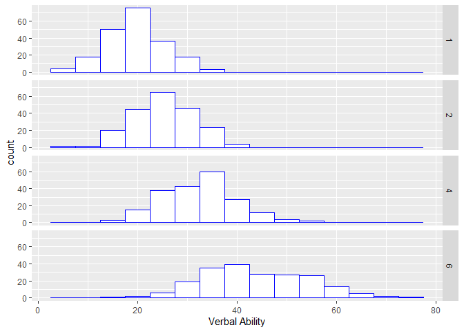
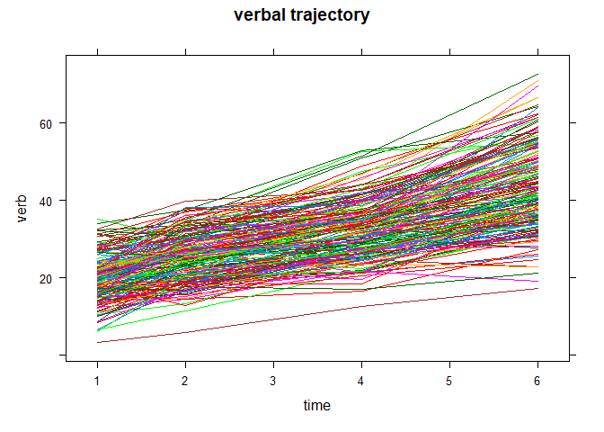
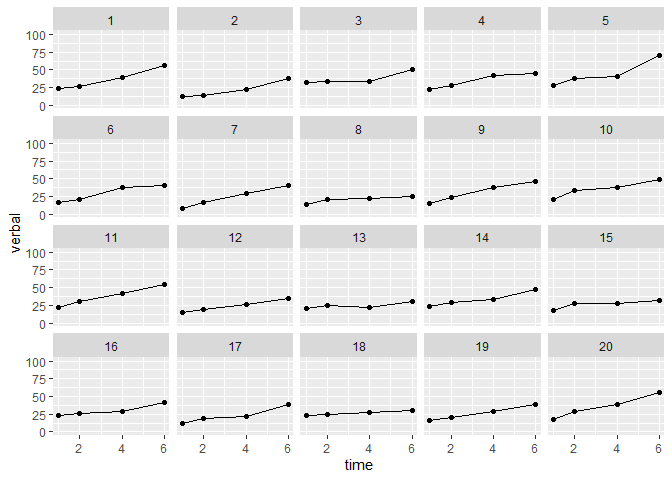

Portfolio3_data_reshaping
================
Yoo Ri Hwang
1/25/2022

# Source & References

<https://quantdev.ssri.psu.edu/tutorials/intro-data-reshape-plots-wisc>
<https://www.statmethods.net/management/reshape.html4>
<https://rfriend.tistory.com/80>
<https://www.datasciencemadesimple.com/reshape-in-r-from-wide-to-long-from-long-to-wide/>

# Overview

In this portfolio, I aim to be familiar with data reshaping. Before I
jump in to the real project, I would make a small dataframe and try
something

## Small dataset trial 1

``` r
id<-c(1,1,2,2)
time<-c(1,2,1,2)
depress<-c(5,3,6,2)
anxiety<-c(6,5,1,4)

small<-data.frame(id,time,depress,anxiety)
print(small)
```

    ##   id time depress anxiety
    ## 1  1    1       5       6
    ## 2  1    2       3       5
    ## 3  2    1       6       1
    ## 4  2    2       2       4

``` r
library(reshape)
mdata <- melt(small, id=c("id","time"))
print(small)
```

    ##   id time depress anxiety
    ## 1  1    1       5       6
    ## 2  1    2       3       5
    ## 3  2    1       6       1
    ## 4  2    2       2       4

``` r
print(mdata)
```

    ##   id time variable value
    ## 1  1    1  depress     5
    ## 2  1    2  depress     3
    ## 3  2    1  depress     6
    ## 4  2    2  depress     2
    ## 5  1    1  anxiety     6
    ## 6  1    2  anxiety     5
    ## 7  2    1  anxiety     1
    ## 8  2    2  anxiety     4

``` r
# cast(data, formula, function)
subjmeans <- cast(mdata, id~variable, mean)
print(subjmeans)
```

    ##   id depress anxiety
    ## 1  1       4     5.5
    ## 2  2       4     2.5

``` r
timemeans <- cast(mdata, time~variable, mean)
print(timemeans)
```

    ##   time depress anxiety
    ## 1    1     5.5     3.5
    ## 2    2     2.5     4.5

## small dataset trial 2

#### data frame

``` r
country<-data.frame(c("A","B","C"),c(100,200,120),c(2000,7000,15000))
colnames(country)<- c("countries","population","gdp")
country
```

    ##   countries population   gdp
    ## 1         A        100  2000
    ## 2         B        200  7000
    ## 3         C        120 15000

#### reshape this wide dataset to long 1

``` r
country_w_to_L<- reshape(data=country, idvar="countries",
                         varying=c("population","gdp"),
                         v.name=c("value"),
                         times=c("population","gdp"),
                         new.row.names=1:1000,
                         direction="long")

print(country_w_to_L)
```

    ##   countries       time value
    ## 1         A population   100
    ## 2         B population   200
    ## 3         C population   120
    ## 4         A        gdp  2000
    ## 5         B        gdp  7000
    ## 6         C        gdp 15000

``` r
# 
# Idvar: ID
# varying: the ones that would be converted from wide to long 
# v.names: value
# new.row.names: used to assign row names to the new dataset
# direction: wide/long
```

#### reshape this wide dataset to long 2

``` r
library(tidyr)

countries_w_to_l_2=gather(country,time,value,population:gdp, factor_key=TRUE)
print(countries_w_to_l_2)
```

    ##   countries       time value
    ## 1         A population   100
    ## 2         B population   200
    ## 3         C population   120
    ## 4         A        gdp  2000
    ## 5         B        gdp  7000
    ## 6         C        gdp 15000

#### reshaping long to wide 1

``` r
country_L_to_W<-reshape(
  data=country_w_to_L,
  v.names="value",
  idvar="countries",
  timevar="time",
  direction="wide"
)

print(country_L_to_W)
```

    ##   countries value.population value.gdp
    ## 1         A              100      2000
    ## 2         B              200      7000
    ## 3         C              120     15000

#### reshaping long to wide 1

``` r
library(tidyr)
countries_l_to_w_2 <-spread(countries_w_to_l_2, time, value)

print(countries_l_to_w_2)
```

    ##   countries population   gdp
    ## 1         A        100  2000
    ## 2         B        200  7000
    ## 3         C        120 15000

# 1. repeated measure data

## load library

``` r
library(psych)    
library(ggplot2)  
library(car)      
library(GGally)
#install.packages('GGally')
library(lattice) 
library(dplyr)
```

##load data

our main data

``` r
filepath <- "https://quantdev.ssri.psu.edu/sites/qdev/files/wisc3raw.csv"
wisc3raw <- read.csv(file=url(filepath),header=TRUE)
```

our small data

## Data cleaning

``` r
#dput(colnames(wisc3raw)) # helpful ! 
#var_names <- tolower(colnames(wisc3raw)) # set all varaible names to lower case. 
```

## Data manipulation

subsetting data

``` r
var_names_sub <- c("id", 
                   "verb1","verb2","verb4","verb6",
                   "perfo1","perfo2","perfo4","perfo6",
                   "momed","grad")
wiscraw <- wisc3raw[,var_names_sub]
str(wiscraw)
```

    ## 'data.frame':    204 obs. of  11 variables:
    ##  $ id    : int  1 2 3 4 5 6 7 8 9 10 ...
    ##  $ verb1 : num  24.4 12.4 32.4 22.7 28.2 ...
    ##  $ verb2 : num  27 14.4 33.5 28.4 37.8 ...
    ##  $ verb4 : num  39.6 21.9 34.3 42.2 41.1 ...
    ##  $ verb6 : num  55.6 37.8 50.2 44.7 71 ...
    ##  $ perfo1: num  19.8 5.9 27.6 33.2 27.6 ...
    ##  $ perfo2: num  23 13.4 45 29.7 44.4 ...
    ##  $ perfo4: num  43.9 18.3 47 46 65.5 ...
    ##  $ perfo6: num  44.2 40.4 77.7 61.7 64.2 ...
    ##  $ momed : num  9.5 5.5 14 14 11.5 14 9.5 5.5 9.5 11.5 ...
    ##  $ grad  : int  0 0 1 1 0 1 0 0 0 0 ...

## Data Reshaping: wide to long

wide to long

``` r
wisclong <- reshape(data=wiscraw,
                    varying = c("verb1","verb2","verb4","verb6",
                                "perfo1","perfo2","perfo4","perfo6"),
                    timevar=c("time"), 
                    idvar=c("id"),
                    direction="long", sep="")

print(head(wisclong,10))
```

    ##      id momed grad time  verb perfo
    ## 1.1   1   9.5    0    1 24.42 19.84
    ## 2.1   2   5.5    0    1 12.44  5.90
    ## 3.1   3  14.0    1    1 32.43 27.64
    ## 4.1   4  14.0    1    1 22.69 33.16
    ## 5.1   5  11.5    0    1 28.23 27.64
    ## 6.1   6  14.0    1    1 16.06  8.45
    ## 7.1   7   9.5    0    1  8.50  4.85
    ## 8.1   8   5.5    0    1 14.11 18.72
    ## 9.1   9   9.5    0    1 15.52 13.37
    ## 10.1 10  11.5    0    1 20.07 15.26

long to wide

``` r
wiscwide <- reshape(data=wisclong, 
                    timevar=c("time"), 
                    idvar=c("id"),
                    v.names=c("verb","perfo"),
                    direction="wide", sep="_")

print(head(wiscwide,100))
```

    ##        id momed grad verb_1 perfo_1 verb_2 perfo_2 verb_4 perfo_4 verb_6
    ## 1.1     1   9.5    0  24.42   19.84  26.98   22.97  39.61   43.90  55.64
    ## 2.1     2   5.5    0  12.44    5.90  14.38   13.44  21.92   18.29  37.81
    ## 3.1     3  14.0    1  32.43   27.64  33.51   45.02  34.30   46.99  50.18
    ## 4.1     4  14.0    1  22.69   33.16  28.39   29.68  42.16   45.97  44.72
    ## 5.1     5  11.5    0  28.23   27.64  37.81   44.42  41.06   65.48  70.95
    ## 6.1     6  14.0    1  16.06    8.45  20.12   15.78  38.02   26.99  39.94
    ## 7.1     7   9.5    0   8.50    4.85  16.49   17.24  28.71   30.75  40.83
    ## 8.1     8   5.5    0  14.11   18.72  20.92   21.43  21.53   33.63  25.68
    ## 9.1     9   9.5    0  15.52   13.37  23.36   20.13  37.41   35.36  45.52
    ## 10.1   10  11.5    0  20.07   15.26  33.38   23.67  37.71   42.59  48.65
    ## 11.1   11  11.5    0  21.59   14.29  31.00   27.24  41.38   32.69  55.00
    ## 12.1   12   9.5    0  15.57   11.12  19.70   19.85  26.68   32.87  34.09
    ## 13.1   13   9.5    0  20.03   11.46  25.42   16.88  22.43   28.18  30.89
    ## 14.1   14  11.5    0  22.75   18.59  29.45   35.61  32.99   36.81  46.90
    ## 15.1   15  11.5    0  18.05   10.51  27.04   23.19  27.25   38.25  32.40
    ## 16.1   16  14.0    1  22.54   23.27  26.68   30.09  28.33   44.70  41.98
    ## 17.1   17   9.5    0  11.22   10.10  19.45   29.51  21.71   28.58  39.29
    ## 18.1   18   9.5    0  22.96   18.85  25.27   27.03  27.44   39.28  30.54
    ## 19.1   19  11.5    0  15.63   32.05  20.18   27.26  29.43   42.31  38.79
    ## 20.1   20  11.5    0  17.93   31.59  29.08   36.78  39.42   53.47  55.16
    ## 21.1   21  11.5    0  21.03   17.66  28.39   21.61  39.38   40.01  60.39
    ## 22.1   22   5.5    0  21.50   10.15  20.80   20.35  30.00   42.17  54.27
    ## 23.1   23  11.5    0  20.30   17.46  28.14   17.69  27.38   33.61  30.68
    ## 24.1   24   9.5    0  15.33    8.90  18.88   20.44  21.96   33.85  31.64
    ## 25.1   25   9.5    0  15.64   12.25  14.48   19.70  16.67   27.71  27.29
    ## 26.1   26  11.5    0  25.82   35.25  35.21   36.78  45.42   56.25  66.52
    ## 27.1   27  14.0    1  24.84   24.85  30.86   42.84  47.54   62.88  56.70
    ## 28.1   28  18.0    1  28.57   32.28  34.32   46.19  44.02   44.06  62.23
    ## 29.1   29  14.0    1  21.07   28.58  25.09   40.03  40.18   48.43  56.15
    ## 30.1   30  14.0    1  17.16   13.30  20.63   22.81  34.84   36.42  37.89
    ## 31.1   31  11.5    0  27.56   25.16  33.65   37.93  51.07   47.42  64.27
    ## 32.1   32  11.5    0  27.83   20.09  37.87   31.78  36.55   51.34  50.85
    ## 33.1   33   8.0    0  18.60   21.98  32.60   40.85  39.27   48.50  54.87
    ## 34.1   34  11.5    0  19.03   18.46  32.28   26.56  37.50   51.85  49.17
    ## 35.1   35   8.0    0  19.26   14.80  31.44   29.30  34.57   44.55  34.30
    ## 36.1   36   5.5    0  20.03   21.38  19.93   23.58  28.02   33.17  34.14
    ## 37.1   37   9.5    0  19.43   18.07  29.38   21.24  45.80   39.12  61.37
    ## 38.1   38  14.0    1  15.48   23.29  24.15   32.88  31.47   48.31  44.54
    ## 39.1   39   9.5    0  12.84   22.10  19.29   29.13  25.09   52.47  32.56
    ## 40.1   40   9.5    0  19.96   20.32  36.29   30.04  35.45   51.06  48.33
    ## 41.1   41   5.5    0   6.58    9.20  11.43   24.96  21.70   36.18  31.28
    ## 42.1   42  11.5    0  17.87   24.65  25.00   36.64  34.09   39.22  43.04
    ## 43.1   43  11.5    0  20.49   20.72  27.25   36.49  34.88   46.83  49.81
    ## 44.1   44   9.5    0  23.69   22.18  24.38   26.71  31.47   48.79  42.50
    ## 45.1   45   5.5    0   8.72    2.86  24.11    9.31  30.64   21.43  39.97
    ## 46.1   46  11.5    0  27.29   29.58  30.43   41.48  48.93   51.30  62.38
    ## 47.1   47  11.5    0  13.32   19.11  17.34   32.82  32.84   42.91  44.82
    ## 48.1   48  11.5    0  35.15   28.69  30.12   38.92  41.62   49.64  54.49
    ## 49.1   49  14.0    1  20.71   18.43  27.72   22.98  30.43   35.38  36.56
    ## 50.1   50   9.5    0  12.38   19.55  19.20   29.77  24.75   44.06  30.64
    ## 51.1   51  11.5    0  23.48   24.68  34.40   40.00  40.21   48.40  48.94
    ## 52.1   52   9.5    0  16.58    7.23  20.97   20.48  29.18   24.23  35.25
    ## 53.1   53   9.5    0  17.53   17.33  30.03   34.65  34.66   40.58  50.36
    ## 54.1   54   5.5    0  13.27    2.52  22.59   10.50  23.62   28.21  36.35
    ## 55.1   55  11.5    0  26.10   31.83  34.72   37.43  52.71   44.71  54.60
    ## 56.1   56   5.5    0  13.02    6.49  15.76   22.48  24.73   21.76  22.74
    ## 57.1   57   9.5    0  16.04   23.15  18.75   24.90  33.50   31.66  45.57
    ## 58.1   58  11.5    0  27.46   15.63  36.13   34.73  41.77   45.44  58.45
    ## 59.1   59   9.5    0  14.70    1.69  21.10   19.48  25.19   34.29  33.10
    ## 60.1   60  14.0    1  31.32   23.49  36.98   37.04  42.83   52.66  55.97
    ## 61.1   61  11.5    0  18.45    7.74  26.41   17.27  29.69   35.69  48.74
    ## 62.1   62   5.5    0  10.55    9.27  13.21   20.46  25.63   44.09  34.09
    ## 63.1   63  14.0    1  27.57   15.80  26.21   32.59  35.45   43.76  58.99
    ## 64.1   64  11.5    0  22.80   31.39  34.64   47.33  40.16   48.10  47.93
    ## 65.1   65   9.5    0  17.74   11.89  18.24   15.06  26.52   25.54  36.09
    ## 66.1   66   9.5    0  10.15    9.10  18.82   12.33  29.29   31.52  36.40
    ## 67.1   67   9.5    0  15.24   14.81  15.54   14.16  20.54   34.13  24.66
    ## 68.1   68   9.5    0  13.96    8.99  14.60   19.76  23.93   26.86  37.90
    ## 69.1   69  14.0    1  26.50   15.85  33.42   27.07  44.30   28.25  48.84
    ## 70.1   70   5.5    0  11.56   12.76  18.93   19.82  23.32   40.60  32.32
    ## 71.1   71   8.0    0  17.62   13.78  29.36   33.39  32.59   38.10  40.42
    ## 72.1   72   9.5    0  16.52   17.30  22.49   19.48  19.48   37.67  37.37
    ## 73.1   73   9.5    0  13.44   11.65  26.52   22.54  26.09   29.75  30.97
    ## 74.1   74   8.0    0  10.86    2.35  17.93   20.61  21.24   26.60  26.09
    ## 75.1   75  11.5    0  20.13   36.51  24.30   32.63  34.84   47.89  33.72
    ## 76.1   76   9.5    0  24.08   14.65  26.85   18.58  28.81   30.83  37.71
    ## 77.1   77  14.0    1  21.03   19.98  30.74   32.70  37.22   46.26  57.86
    ## 78.1   78  11.5    0  26.06   21.60  22.78   32.63  37.34   42.96  41.26
    ## 79.1   79  11.5    0  21.49    9.35  26.00   14.88  33.26   29.29  40.10
    ## 80.1   80  11.5    0  33.96   35.96  37.50   33.99  52.84   49.38  57.47
    ## 81.1   81   9.5    0  13.27   14.53  20.03   15.11  21.68   27.95  30.01
    ## 82.1   82  11.5    0  24.48   20.39  24.27   21.80  37.19   41.10  39.06
    ## 83.1   83  11.5    0  17.20   19.25  28.18   25.84  28.48   40.36  43.54
    ## 84.1   84  11.5    0  19.05   20.27  29.35   21.46  34.17   43.98  45.71
    ## 85.1   85   5.5    0  15.83   11.86  16.25   25.07  26.04   38.90  35.83
    ## 86.1   86  11.5    0  18.24   17.83  26.56   36.20  30.97   46.94  40.85
    ## 87.1   87  14.0    1  23.07   13.84  20.94   20.49  30.34   32.46  27.69
    ## 88.1   88   8.0    0  19.26    3.55  21.96   18.13  28.45   48.13  42.05
    ## 89.1   89   8.0    0  22.19   13.14  27.78   19.77  32.47   30.38  37.40
    ## 90.1   90   5.5    0  28.27   24.88  31.85   40.80  34.87   54.98  52.50
    ## 91.1   91  11.5    0  18.42    3.24  19.70    7.93  25.30   14.19  30.74
    ## 92.1   92  14.0    1  26.10   32.96  32.65   38.10  35.18   47.25  54.90
    ## 93.1   93  11.5    0  23.01   23.82  32.86   33.66  35.18   45.32  51.61
    ## 94.1   94  14.0    1  12.13   12.76  22.53   22.45  26.82   27.78  36.01
    ## 95.1   95  14.0    1  14.00   27.86  26.03   41.20  35.76   44.83  44.85
    ## 96.1   96  11.5    0  18.62   14.28  19.39   22.99  24.93   33.53  37.17
    ## 97.1   97  11.5    0  21.96   18.61  27.56   45.75  39.02   43.54  49.94
    ## 98.1   98  11.5    0  31.34   34.28  25.15   37.25  41.67   57.86  50.94
    ## 99.1   99  11.5    0  12.13   28.03  23.63   37.49  26.12   44.70  55.58
    ## 100.1 100   5.5    0  16.21    8.01  26.93   15.47  21.43   32.37  40.01
    ##       perfo_6
    ## 1.1     44.19
    ## 2.1     40.38
    ## 3.1     77.72
    ## 4.1     61.66
    ## 5.1     64.22
    ## 6.1     39.08
    ## 7.1     41.03
    ## 8.1     42.36
    ## 9.1     38.53
    ## 10.1    48.39
    ## 11.1    48.17
    ## 12.1    35.61
    ## 13.1    34.32
    ## 14.1    56.20
    ## 15.1    52.01
    ## 16.1    45.51
    ## 17.1    32.81
    ## 18.1    46.41
    ## 19.1    51.34
    ## 20.1    58.49
    ## 21.1    46.67
    ## 22.1    59.61
    ## 23.1    43.31
    ## 24.1    40.28
    ## 25.1    39.14
    ## 26.1    68.58
    ## 27.1    64.07
    ## 28.1    61.13
    ## 29.1    57.31
    ## 30.1    62.20
    ## 31.1    54.40
    ## 32.1    60.03
    ## 33.1    49.52
    ## 34.1    50.90
    ## 35.1    48.89
    ## 36.1    52.04
    ## 37.1    54.62
    ## 38.1    67.89
    ## 39.1    68.38
    ## 40.1    58.87
    ## 41.1    45.44
    ## 42.1    54.29
    ## 43.1    63.11
    ## 44.1    54.35
    ## 45.1    27.33
    ## 46.1    61.10
    ## 47.1    46.54
    ## 48.1    60.64
    ## 49.1    43.40
    ## 50.1    57.19
    ## 51.1    68.24
    ## 52.1    40.12
    ## 53.1    52.83
    ## 54.1    31.18
    ## 55.1    60.92
    ## 56.1    31.12
    ## 57.1    51.67
    ## 58.1    52.49
    ## 59.1    36.18
    ## 60.1    56.26
    ## 61.1    36.72
    ## 62.1    43.64
    ## 63.1    55.58
    ## 64.1    64.00
    ## 65.1    26.55
    ## 66.1    36.71
    ## 67.1    34.15
    ## 68.1    31.48
    ## 69.1    36.84
    ## 70.1    57.52
    ## 71.1    54.01
    ## 72.1    40.19
    ## 73.1    40.37
    ## 74.1    34.88
    ## 75.1    53.61
    ## 76.1    39.84
    ## 77.1    61.13
    ## 78.1    60.92
    ## 79.1    41.16
    ## 80.1    64.75
    ## 81.1    39.34
    ## 82.1    55.99
    ## 83.1    43.03
    ## 84.1    57.36
    ## 85.1    53.07
    ## 86.1    61.92
    ## 87.1    43.74
    ## 88.1    68.29
    ## 89.1    52.92
    ## 90.1    64.04
    ## 91.1    20.51
    ## 92.1    50.42
    ## 93.1    67.22
    ## 94.1    56.42
    ## 95.1    62.46
    ## 96.1    45.70
    ## 97.1    63.72
    ## 98.1    68.49
    ## 99.1    63.12
    ## 100.1   37.47

### Descriptives for the repeated data

1.  sample-level descriptive

``` r
describe(wisclong$verb)
```

    ##    vars   n  mean    sd median trimmed   mad  min   max range skew kurtosis
    ## X1    1 816 30.34 11.86  28.46   29.39 11.33 3.33 72.59 69.26 0.71     0.33
    ##      se
    ## X1 0.42

2.  sample-level descriptive across time

``` r
describe(wiscwide[c("verb_1","verb_2","verb_4","verb_6")])
```

    ##        vars   n  mean    sd median trimmed   mad   min   max range  skew
    ## verb_1    1 204 19.59  5.81  19.34   19.50  5.41  3.33 35.15 31.82  0.13
    ## verb_2    2 204 25.42  6.11  25.98   25.40  6.57  5.95 39.85 33.90 -0.06
    ## verb_4    3 204 32.61  7.32  32.82   32.42  7.18 12.60 52.84 40.24  0.23
    ## verb_6    4 204 43.75 10.67  42.55   43.46 11.30 17.35 72.59 55.24  0.24
    ##        kurtosis   se
    ## verb_1    -0.05 0.41
    ## verb_2    -0.34 0.43
    ## verb_4    -0.08 0.51
    ## verb_6    -0.36 0.75

``` r
describeBy(wisclong[,c("verb")],group=wisclong$time)
```

    ## 
    ##  Descriptive statistics by group 
    ## group: 1
    ##    vars   n  mean   sd median trimmed  mad  min   max range skew kurtosis   se
    ## X1    1 204 19.59 5.81  19.34    19.5 5.41 3.33 35.15 31.82 0.13    -0.05 0.41
    ## ------------------------------------------------------------ 
    ## group: 2
    ##    vars   n  mean   sd median trimmed  mad  min   max range  skew kurtosis   se
    ## X1    1 204 25.42 6.11  25.98    25.4 6.57 5.95 39.85  33.9 -0.06    -0.34 0.43
    ## ------------------------------------------------------------ 
    ## group: 4
    ##    vars   n  mean   sd median trimmed  mad  min   max range skew kurtosis   se
    ## X1    1 204 32.61 7.32  32.82   32.42 7.18 12.6 52.84 40.24 0.23    -0.08 0.51
    ## ------------------------------------------------------------ 
    ## group: 6
    ##    vars   n  mean    sd median trimmed  mad   min   max range skew kurtosis
    ## X1    1 204 43.75 10.67  42.55   43.46 11.3 17.35 72.59 55.24 0.24    -0.36
    ##      se
    ## X1 0.75

visualization- across time

``` r
ggplot(data=wisclong, aes(x=verb)) +
  geom_histogram(binwidth=5, pad = TRUE, fill="white", color="blue") + 
  xlab("Verbal Ability") +
  facet_grid(time ~ .)
```

<!-- -->

3.  individual-level descriptives across time

``` r
library(lattice)

xyplot(verb ~ time, groups=id, 
       data=wisclong, type="l",
       main="verbal trajectory")
```

<!-- -->

``` r
# ggplot(data = wisclong, aes(x =time, y = verb, group = id)) +
#   geom_point() + 
#   geom_line() +
#   xlab("time") + 
#   ylab("Verbal Ability") + ylim(0,80) +
#   scale_x_continuous(breaks=seq(1,5,by=1))
```

Visualization of small samples

``` r
ggplot(data=wisclong[which(wisclong$id<=20),], aes(x=time, y=verb, group=id)) +
  geom_point()+
  geom_line(data=wisclong[which(wisclong$id <=20 & wisclong$verb !="NA"),])+
              xlab("time")+
              ylab("verbal")+ylim(0,100) +
              facet_wrap(~id)
```

<!-- -->
